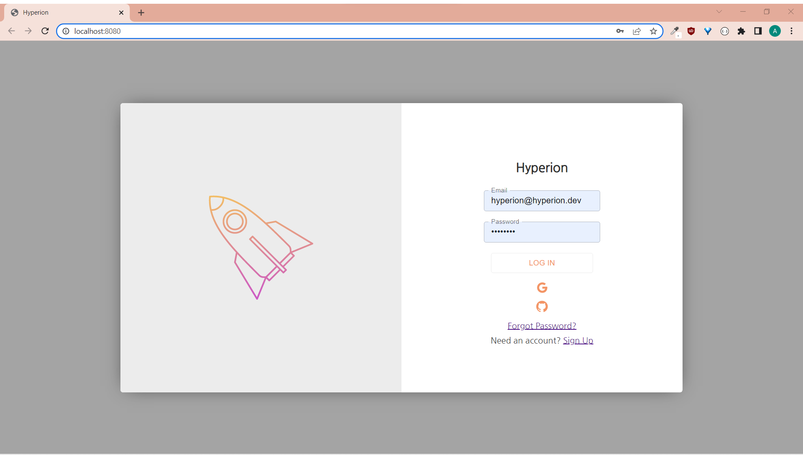
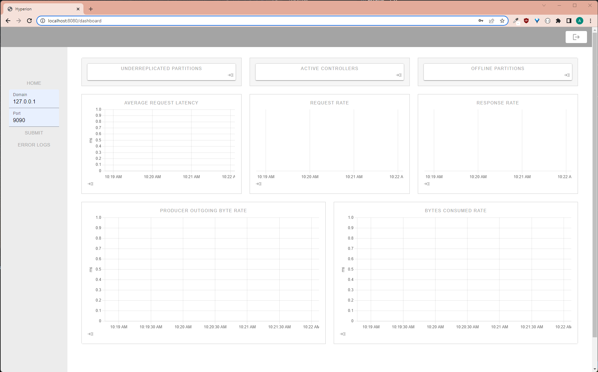

# GitHub Tutorial
<div align="center">
  <a href="https://https://github.com/oslabs-beta/hyperionn">
     
  </a>
  <h1>Hyperion</h1>
  <p>An open-source Kafka monitoring tool built for developers<p>
  <a href="https://github.com/oslabs-beta/ksqljs"></a>
  <a href="https://github.com/oslabs-beta/ksqljs/stargazers"></a>
  <a href="https://github.com/oslabs-beta/ksqljs/issues"></a>
  
  
  <a href=""><strong>hyperionapp.dev</strong></a>
</div>

## Table of Contents

1. [About the Project](#about-the-project)
   - [Built With](#built-with)
1. [Getting Started](#getting-started)
   - [Requirements](#requirements)
   - [Installation](#installation)
   - [Usage](#when-you're-ready-to-use-hyperion)
1. [Demo](#demo)
1. [Roadmap](#roadmap)
1. [Contributors](#contributors)
1. [Support the  Project](#support-the-project)
1. [License](#license)

## About the Project

Hyperion is an open-source visualization tool for monitoring crucial health metrics of your Kafka cluster. This tool allows developers to quickly assess the functionality of their Kafka cluster, as well as identify metrics that become out of the appropriate range. Real-time metrics are consolidated in one dashboard for easy access, and developers have access to an error log where instances of out-of-range metrics are displayed. This application can be deployed on your local network.

Featured metrics include: under-replicated partitions, offline partitions, active controller count, producer average request latency, request rate, response rate, bytes consumed rate, and producer outgoing byte rate. 

### Built With

- [Chart.js](https://www.chartjs.org/)
- [React](https://reactjs.org/)
- [Material-UI](https://mui.com/)
- [FireBase SDK Authentication](https://firebase.google.com/docs/auth)
- [PromQL](https://prometheus.io/)
- [Node.js/Express](https://expressjs.com/)
- [Socket.io](https://socket.io/)
- [Vite.js](https://vitejs.dev/)


## Getting Started

### Requirements

1. You will need npm and the latest version of Node.js.

2. Ports 3001 and 8080 need to be available to run this application. 

3. Make sure you have a running Kafka cluster with a configured Prometheus instance (you will need the domain and port of where Prometheus is running)

### Installation

1. Clone this repository in your local machine:

```
git clone https://github.com/oslabs-beta/hyperionn
```

2. Install all dependencies:

```
npm install
```

4. Build your version of Hyperion:

```
npm run build
```

### When you're ready to use Hyperion

1. Start the server:

```
npm start
```

2. Hyperion defaults to running on port 3000. Simply go to http://localhost:3000 to view your metrics and start managing your Kafka cluster!

3. After you log in, click ‘connect’ in the side navbar. Input the port number and the domain where your prometheus instance is running for your Kafka cluster and click ‘submit’. 

4. Congratulations! You can now view live streaming of data. 

Note: When the simple key metrics (active controllers, under-replicated partitions, offline partitions) are not their expected values, the app will store the occurrence and display them in the error log found on the side navbar.


## Demo
<div>
 
</div>
1. Login with traditional sign up or Google/Github SDK authentication.

<div>
 
</div>
2. Connect to your Prometheus domain/IP and port.

<div>
 
</div>
3. Your dashboard will populate with the metrics after connecting.

<div>
 
</div>
4. Utilize the Error Logs to view occurences of out of range metrics.


## Roadmap

Here are some features the Hyperion team is working on adding to the application in the near future:

- Additional metrics to view monitor performance
- Ability to customize dashboard with metrics that are important to your Kafka cluster
- End-to-end testing with Cypress
- Refactoring codebase to Typescript for static testing

If there is a feature you think would be useful to you and your team, or if you find any bugs, please [open an issue](https://github.com/oslabs-beta/hyperionn/issues). 


## Contributors

- Anish Patel | [GitHub](https://github.com/justanotherguyonline) | [Linkedin](https://www.linkedin.com/in/anish-patel-759545123/)
- Kristin Green | [GitHub](https://github.com/kngreen) | [Linkedin](https://www.linkedin.com/in/kristin-green-101902a4/)
- Joey Friedman | [GitHub](https://github.com/fried-jo) | [Linkedin](https://www.linkedin.com/in/joseph-friedman-803803149/)
- Anita Duong | [GitHub](https://github.com/anitaduong98) | [Linkedin](https://www.linkedin.com/in/anita-duong/)


## Support the Project

Contributions are welcomed and appreciated. You can do the following to support the project!

- Star this repository 
- Raise new issues
- Fork, clone, and make a PR to solve an issue
- Check out our [Medium article](https://medium.com/@friedman.joey/hyperion-take-control-over-the-health-of-your-kafka-clusters-796eb061b53c)


## License

This product is licensed under the MIT License without restriction.


