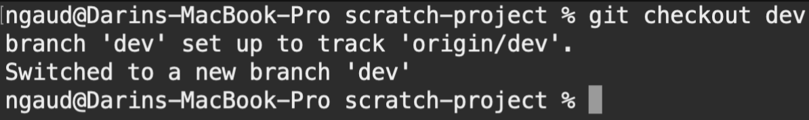
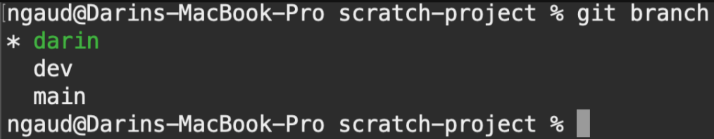
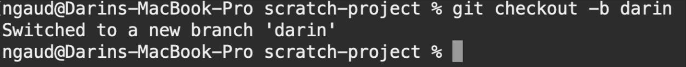
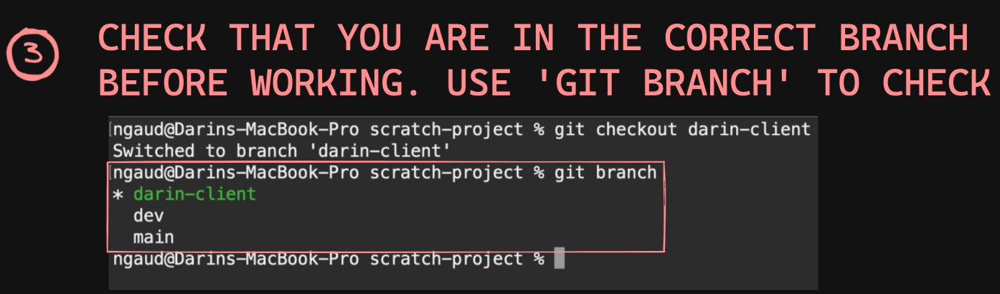
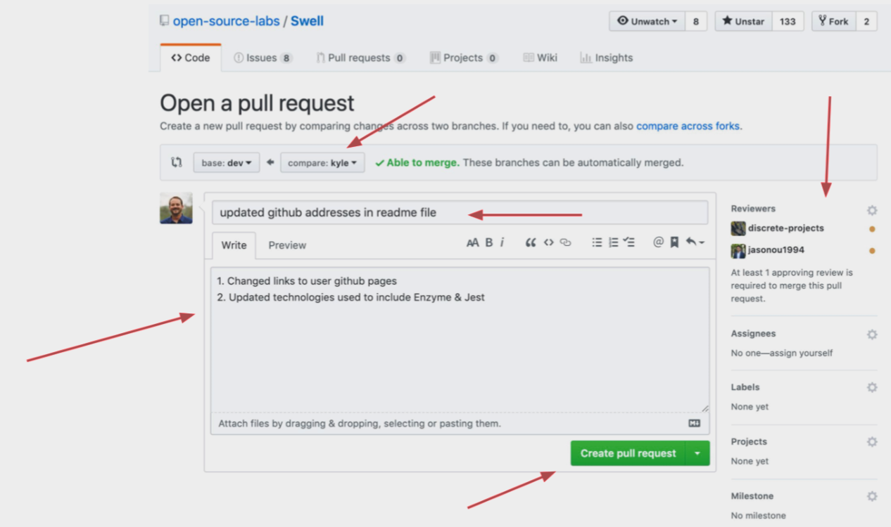

# Getting Started with Create React App

This project was bootstrapped with [Create React App](https://github.com/facebook/create-react-app).

## Available Scripts

In the project directory, you can run:

### `npm start`

Runs the app in the development mode.\
Open [http://localhost:3000](http://localhost:3000) to view it in your browser.

The page will reload when you make changes.\
You may also see any lint errors in the console.

### `npm test`

Launches the test runner in the interactive watch mode.\
See the section about [running tests](https://facebook.github.io/create-react-app/docs/running-tests) for more information.

### `npm run build`

Builds the app for production to the `build` folder.\
It correctly bundles React in production mode and optimizes the build for the best performance.

The build is minified and the filenames include the hashes.\
Your app is ready to be deployed!

See the section about [deployment](https://facebook.github.io/create-react-app/docs/deployment) for more information.

### `npm run eject`

**Note: this is a one-way operation. Once you `eject`, you can't go back!**

If you aren't satisfied with the build tool and configuration choices, you can `eject` at any time. This command will remove the single build dependency from your project.

Instead, it will copy all the configuration files and the transitive dependencies (webpack, Babel, ESLint, etc) right into your project so you have full control over them. All of the commands except `eject` will still work, but they will point to the copied scripts so you can tweak them. At this point you're on your own.

You don't have to ever use `eject`. The curated feature set is suitable for small and middle deployments, and you shouldn't feel obligated to use this feature. However we understand that this tool wouldn't be useful if you couldn't customize it when you are ready for it.

## Learn More

You can learn more in the [Create React App documentation](https://facebook.github.io/create-react-app/docs/getting-started).

To learn React, check out the [React documentation](https://reactjs.org/).

### Code Splitting

This section has moved here: [https://facebook.github.io/create-react-app/docs/code-splitting](https://facebook.github.io/create-react-app/docs/code-splitting)

### Analyzing the Bundle Size

This section has moved here: [https://facebook.github.io/create-react-app/docs/analyzing-the-bundle-size](https://facebook.github.io/create-react-app/docs/analyzing-the-bundle-size)

### Making a Progressive Web App

This section has moved here: [https://facebook.github.io/create-react-app/docs/making-a-progressive-web-app](https://facebook.github.io/create-react-app/docs/making-a-progressive-web-app)

### Advanced Configuration

This section has moved here: [https://facebook.github.io/create-react-app/docs/advanced-configuration](https://facebook.github.io/create-react-app/docs/advanced-configuration)

### Deployment

This section has moved here: [https://facebook.github.io/create-react-app/docs/deployment](https://facebook.github.io/create-react-app/docs/deployment)

### `npm run build` fails to minify

This section has moved here: [https://facebook.github.io/create-react-app/docs/troubleshooting#npm-run-build-fails-to-minify](https://facebook.github.io/create-react-app/docs/troubleshooting#npm-run-build-fails-to-minify)

# GitHub Tutorial

<a href="https://excalidraw.com/#json=oPciaBeml8N1pVKFR27uB,cSQoBdLi9vR_jbHPsHer8w" target="_blank">Visual Guild Linked Here</a>

## Creating a New Branch

1. Clone repo to your local system.
- `git clone https://github.com/oslabs-beta/Hyperionn.git`

2. Create or go to `dev` branch
- `git checkout dev`

3. Create or go to your branch
- `git checkout -b [your-name/feature]`

4. Check what branch you are currently on
- `git branch`

## Starting Workflow

1. Make sure local branch is up to date with `dev` branch before working
- `git checkout dev` (locally switch to dev branch)
- `git pull origin dev` (pull updates of dev down to your localc system)
- `git checkout <YOUR BRANCH>` (switch back to your branch locally)
- `git merge dev` (brings dev int your branch locally)
- Resolve conflicts or `:q` if there aren't any 

2. Create or go to your branch. PRO TIP: Use tab to autofill
- `git checkout -b [your-name/feature]`

3. Use `git branch` to make sure you are on the correct branch

## Saving and Uploading Code
1. Before pushing code to GitHub. Merge any updates from `dev`. Solve any conflicts (aka differences) between `dev` and your local branch 
- `git checkout dev` (locally switch to dev branch)
- `git pull origin dev` (pull updates of dev down to your localc system)
- `git checkout <YOUR BRANCH>` (switch back to your branch locally)
- `git merge dev` (brings dev int your branch locally)
- Resolve conflicts or `:q` if there aren't any 

2. Git add & git commit your files. MAKE SURE YOU ARE ON YOUR BRANCH BEFORE COMMITING! (use `git branch` to check)
- `git add <YOUR FILES>`
- `git commit -m"<YOUR COMMENT>`

3. Push files to your branch
- `git push origin <YOUR BRANCH>`

4. Create a pull request on GitHub
  - base: dev <-- compare: [YOUR BRANCH NAME]
  - add comments
  - add reviewers (on the right sidebar)
  - click create pull request

5. Review, Approve and Merge pull request to `dev` branch